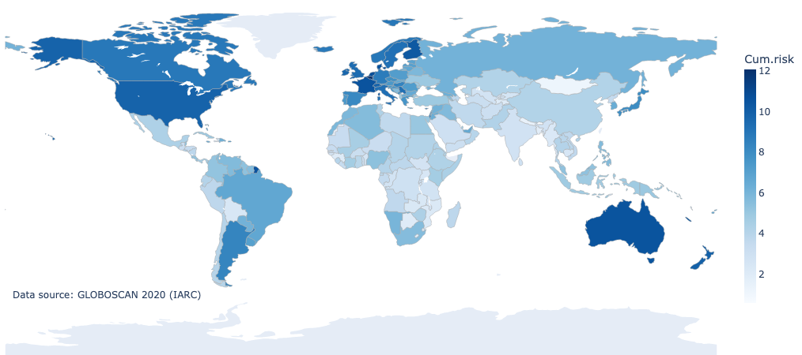

# [breast-cancer-stats](https://github.com/andreped/breast-cancer-stats#breast-cancer-stats)

[](https://github.com/DAVFoundation/captain-n3m0/blob/master/LICENSE)
[](https://doi.org/10.5281/zenodo.8232699)
<a href="https://colab.research.google.com/github/andreped/breast-cancer-stats/blob/main/apps/breast_cancer_incidence_rate.ipynb" target="_parent"></a>


This repository contains useful notebook examples on how to extract and visualize
breast cancer data from the World Health Organization (WHO) database.

<p style="text-align: left;">
  
</p>

## [Examples](https://github.com/andreped/breast-cancer-stats#examples)

Example notebooks are available in the [apps/](https://github.com/andreped/breast-cancer-stats/tree/main/apps) directory.

They can also be accessed by clicking their respective CoLab badge below:

| Use case | Notebook | Tests |
| - | - | - |
| Incidence rate world map | <a href="https://colab.research.google.com/github/andreped/breast-cancer-stats/blob/main/apps/breast_cancer_incidence_rate.ipynb" target="_parent"></a> | <a href="https://github.com/andreped/breast-cancer-stats/actions/workflows/incidence.yml" target="_parent"></a> |
| Mortality rate world map | <a href="https://colab.research.google.com/github/andreped/breast-cancer-stats/blob/main/apps/breast_cancer_mortality_rate.ipynb" target="_parent"></a> | <a href="https://github.com/andreped/breast-cancer-stats/actions/workflows/mortality.yml" target="_parent"></a> |
| Overall cancer statistics | <a href="https://colab.research.google.com/github/andreped/breast-cancer-stats/blob/main/apps/breast_cancer_statistics.ipynb" target="_parent"></a> | <a href="https://github.com/andreped/breast-cancer-stats/actions/workflows/statistics.yml" target="_parent"></a> |
| Survival country comparison | <a href="https://colab.research.google.com/github/andreped/breast-cancer-stats/blob/main/apps/bc_survival.ipynb" target="_parent"></a> | <a href="https://github.com/andreped/breast-cancer-stats/actions/workflows/survival.yml" target="_parent"></a> |
| Cancer incidence over time | <a href="https://colab.research.google.com/github/andreped/breast-cancer-stats/blob/main/apps/bc_incidence_over_time.ipynb" target="_parent"></a> | <a href="https://github.com/andreped/breast-cancer-stats/actions/workflows/incidence_temporal.yml" target="_parent"></a> |
| Cancer mortality over time | <a href="https://colab.research.google.com/github/andreped/breast-cancer-stats/blob/main/apps/bc_mortality_over_time.ipynb" target="_parent"></a> | <a href="https://github.com/andreped/breast-cancer-stats/actions/workflows/mortality_temporal.yml" target="_parent"></a> |
| Cancer incidence over time w.r.t. age | <a href="https://colab.research.google.com/github/andreped/breast-cancer-stats/blob/main/apps/bc_incidence_over_time_age_groups.ipynb" target="_parent"></a> | <a href="https://github.com/andreped/breast-cancer-stats/actions/workflows/incidence_temporal_age.yml" target="_parent"></a> |
| Cancer mortality over time w.r.t. age | <a href="https://colab.research.google.com/github/andreped/breast-cancer-stats/blob/main/apps/bc_mortality_over_time_age_groups.ipynb" target="_parent"></a> | <a href="https://github.com/andreped/breast-cancer-stats/actions/workflows/mortality_temporal_age.yml" target="_parent"></a> |

## [Dependencies](https://github.com/andreped/breast-cancer-stats#dependencies)

The Notebooks were tested against Python 3.8 on macOS operating system. Continuous integration tests are also performed for all notebooks
on Ubuntu 20.04 operating system (see [here](https://github.com/andreped/breast-cancer-stats/actions)). They are also compatible with
Google CoLab and should be quite robust against other setups.

The following dependencies were used and are installed as part of the notebooks:

* [pandas](https://pypi.org/project/pandas/)
* [plotly](https://pypi.org/project/plotly/)
* [nbformat](https://pypi.org/project/nbformat/)
* [kaleido](https://pypi.org/project/kaleido/)

## [Troubleshooting](https://github.com/andreped/breast-cancer-stats#troubleshooting)

Note that all rendered results could be interactive, but we have set Plotly's `show(renderer="png")`,
to enable the result to be shown in the output on CoLab, on GitHub, and locally. To get interactive
figures on CoLab set `show(renderer="colab")`, or locally use the default `show()`. GitHub only support static figures.

## [License](https://github.com/andreped/breast-cancer-stats#license)

The code in this repository is released under [MIT license](https://github.com/andreped/breast-cancer-stats/blob/main/LICENSE).

Note that the CSV files originate from WHO-related websites. Global data from [Cancer Today](https://gco.iarc.fr/today/home)
(powered by GLOBOCAN 2020) and Nordic data from [NORDCAN](https://nordcan.iarc.fr/en).
If you use these figures or datasets, please, cite the appropriate
references. Information on how to cite these can be found [here](https://gco.iarc.fr/today/about#references) and
[here](https://nordcan.iarc.fr/en/about), respectively.

## [Citation](https://github.com/andreped/breast-cancer-stats#citation)

If you found this project useful, please, consider citing it in your research article:

```
@software{andre_pedersen_2023_8224208,
  author       = {André Pedersen},
  title        = {andreped/breast-cancer-stats: v0.1.0},
  month        = aug,
  year         = 2023,
  publisher    = {Zenodo},
  version      = {v0.1.0},
  doi          = {10.5281/zenodo.8224207},
  url          = {https://doi.org/10.5281/zenodo.8224207}
}
```
